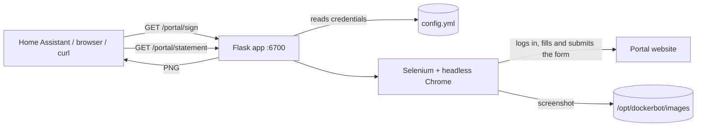

*Please :star: this repo if you find it useful*

<p align="left"><br>
<a href="https://www.paypal.com/paypalme/techblogil?locale.x=he_IL" target="_blank"></a>
</p>


# HAvid-19

HAvid-19 is an easy-to-use Docker container, powered by [Flask](https://flask.palletsprojects.com/) and [Selenium](https://www.selenium.dev/), that signs Israeli COVID-19 digital health statements (הצהרת בריאות) on school and workplace portals.
It exposes a small HTTP API: one call signs the statement with headless Chrome, and a second call returns a screenshot of the signed form.
It was built to be triggered from [Home Assistant](https://www.home-assistant.io/) (a button on a dashboard, an automation, a morning routine), and is a sibling of [Botvid-19](https://github.com/t0mer/Botvid-19), which does the same from a Telegram bot.

> **Project status:** the application code was last changed in January 2021, during the COVID-19 period. The health-statement forms it automates were COVID-era requirements, and the portals have almost certainly changed or removed these pages since then, so signing is not expected to work today. The repository is kept for reference. <!-- TODO: verify whether any of the supported portals still offers a health statement -->

#### Credits:

- [Adam Russak](https://github.com/AdamRussak) for working with me on this project and writing the Selenium part

## Table of contents

- [Features](#features)
- [Supported portals](#supported-portals)
- [How it works](#how-it-works)
- [Requirements](#requirements)
- [Installation](#installation)
- [Configuration](#configuration)
- [HTTP API](#http-api)
- [Home Assistant integration](#home-assistant-integration)
- [Security notes](#security-notes)
- [Troubleshooting](#troubleshooting)
- [Contributing](#contributing)
- [License](#license)
- [Donation](#donation)

## Features

- Signs the daily health statement on seven portals (one of them unfinished, see below), each with its own endpoint.
- Mashov: signs for any number of kids in one call (`kid1`, `kid2`, ... in the config).
- Saves a screenshot of the signed form for each portal and serves it over HTTP, so you can show it on a Home Assistant dashboard. Until a statement has been signed, a "please sign" placeholder image is returned.
- All credentials live in a single `config.yml`, which is created automatically on first start.
- Runs headless Chrome and ChromeDriver inside the container; nothing to install on the host besides Docker.

## Supported portals

| Portal | Who it is for | Sign endpoint | Status |
|--------|---------------|---------------|--------|
| [Ministry of Education parents portal](https://parents.education.gov.il) (kindergarten health statement) | Parents | `/edu/sign` | Implemented |
| [Mashov](https://web.mashov.info/students/login) | Students / parents (multiple kids) | `/mashov/sign` | Implemented |
| [Webtop](https://www.webtop.co.il) (login through the Ministry of Education identity) | Students / parents | `/webtop/sign` | Implemented |
| Infogan (web form at a URL you configure) | Parents (kid + parent details) <!-- TODO: verify --> | `/infogan/sign` | Implemented |
| Hilan (form at a URL you configure) | Employees | `/hilan/sign` | Implemented |
| Amdocs (internal ServiceNow portal, Microsoft sign-in) | Amdocs employees | `/amdocs/sign` | Implemented |
| Hbinov (form at a URL you configure) | Employees | `/hbinov/sign` | Marked "Not Operational Yet" in the code |

## How it works



1. A request to `/<portal>/sign` reads `config.yml` and checks that the portal is configured.
2. A worker script for that portal opens headless Chrome, logs in, answers the health questions, and submits the form.
3. It saves a screenshot to `/opt/dockerbot/images/<portal>_approval.png` (for Mashov: `mashov_approval_<kid number>.png`).
4. A request to `/<portal>/statement` returns that screenshot.

Signing takes several seconds per portal (the original docs mention 8-10 seconds for the parents portal).

## Requirements

- Docker (or Docker Compose).
- An `amd64` host. Google Chrome is only published for `amd64`, and the only image on Docker Hub is `amd64`.
- An account on each portal you want to sign.

## Installation

The image is published on Docker Hub as [`techblog/havid-19`](https://hub.docker.com/r/techblog/havid-19) (tags `latest`, `dev`, `test`; `amd64` only).
The `latest` tag was last pushed in January 2021.

### Docker Compose

```yaml
version: "3.7"

services:
  havid-19:
    image: techblog/havid-19
    container_name: havid-19
    restart: always
    labels:
      - "com.ouroboros.enable=true"
    volumes:
      - ./config:/opt/dockerbot/config
    ports:
      - "6700:6700"
```

The `docker-compose.yml` in this repository still lists `API_KEY`, `ALLOWED_IDS`, `USER_ID` and `USER_KEY` environment variables (copied from Botvid-19). The code does not read them: all settings come from `config.yml`.

### Docker run

```bash
docker run -d --name havid-19 --restart always \
  -p 6700:6700 \
  -v "$(pwd)/config:/opt/dockerbot/config" \
  techblog/havid-19
```

On first start the container copies a template `config.yml` into `/opt/dockerbot/config`. Edit it (see [Configuration](#configuration)); it is re-read on every request, so no restart is needed.

> Mount the config at `/opt/dockerbot/config`. The Dockerfile declares a `VOLUME` at `/opt/config`, but the application does not use that path.

### Build from source

```bash
git clone https://github.com/t0mer/HAvid-19.git
cd HAvid-19
docker build -t havid-19 .
```

A fresh build is unlikely to work without changes; see [Troubleshooting](#troubleshooting).

## Configuration

All settings are in `/opt/dockerbot/config/config.yml`, one block per portal. Leave the values of portals you don't use empty.

| Block | Key | Description |
|-------|-----|-------------|
| `edu` | `USER_ID` | Ministry of Education identity user code (parents portal) |
| `edu` | `USER_KEY` | Ministry of Education identity password |
| `mashov` | `kidN` | One sub-block per kid: `kid1`, `kid2`, ... numbered consecutively. For an unused kid, either remove the whole block or keep all three keys with empty values. An empty block (`kid2:` with no keys) is still counted and makes the call fail with a `TypeError` after the earlier kids were already signed |
| `mashov.kidN` | `MASHOV_USER_ID_KID` | The kid's Mashov user name |
| `mashov.kidN` | `MASHOV_USER_PWD_KID` | The kid's Mashov password |
| `mashov.kidN` | `MASHOV_SCHOOL_ID_KID` | School ID (semel mosad) as selected on the Mashov login page |
| `infogan` | `BASE_URL` | URL of the Infogan health statement form |
| `infogan` | `PARENT_NAME` | Parent's full name |
| `infogan` | `PARENT_ID` | Parent's ID number |
| `infogan` | `KID_NAME` | Kid's full name |
| `infogan` | `KID_ID` | Kid's ID number |
| `webtop` | `USER_ID` | Ministry of Education identity user code (used to log in to Webtop) |
| `webtop` | `USER_KEY` | Ministry of Education identity password |
| `hilan` | `URL` | URL of the Hilan health statement form |
| `hilan` | `EMPLOYEE_NUM` | Employee number |
| `hilan` | `PASSWORD` | Hilan password |
| `amdocs` | `EMAIL` | Corporate e-mail (Microsoft sign-in) |
| `amdocs` | `USER_ID` | Corporate user name |
| `amdocs` | `PASSWORD` | Corporate password |
| `hbinov` | `URL`, `USER_NAME`, `PASSWORD`, `NAME`, `MOBILE`, `ID` | Hbinov login and the form's personal details. Not operational yet |
| `hbinov` | `SIG_FILE` | Name of a file in the config folder whose content (a data-URL string) is used as the signature image. The template ships a `SIG_FILE_NAME` key instead, which the code never reads; rename it to `SIG_FILE` |

Example layout (values are placeholders):

```yaml
edu:
    USER_ID: 123456789
    USER_KEY: my-password
mashov:
    kid1:
        MASHOV_USER_ID_KID: 123456789
        MASHOV_USER_PWD_KID: my-password
        MASHOV_SCHOOL_ID_KID: 123456
    kid2:
        MASHOV_USER_ID_KID:
        MASHOV_USER_PWD_KID:
        MASHOV_SCHOOL_ID_KID:
webtop:
    USER_ID:
    USER_KEY:
# ... infogan, hilan, amdocs and hbinov blocks follow the same pattern
```

Keep every portal block in the file, even if its values are empty: the sign endpoints look the block up and fail if it is missing.

## HTTP API

The API listens on port **6700**. All endpoints are `GET` and need no authentication.

| Method | Path | Description |
|--------|------|-------------|
| GET | `/edu/sign` | Sign on the Ministry of Education parents portal |
| GET | `/edu/statement` | Screenshot of the last signed statement |
| GET | `/mashov/sign` | Sign on Mashov for every configured kid |
| GET | `/mashov/statement?kid=N` | Screenshot for kid number `N` (`kid=1`, `kid=2`, ...) |
| GET | `/webtop/sign` | Sign on Webtop |
| GET | `/webtop/statement` | Screenshot of the last signed statement |
| GET | `/infogan/sign` | Sign the Infogan form |
| GET | `/infogan/statement` | Screenshot of the last signed statement |
| GET | `/hilan/sign` | Sign on Hilan |
| GET | `/hilan/statement` | Screenshot of the last signed statement |
| GET | `/amdocs/sign` | Sign on the Amdocs portal |
| GET | `/amdocs/statement` | Screenshot of the last signed statement |
| GET | `/hbinov/sign` | Sign on Hbinov (not operational yet) |
| GET | `/hbinov/statement` | Screenshot of the last signed statement |

The `statement` endpoints return a PNG screenshot, or the `please_sign.jpg` placeholder if nothing has been signed yet.

The `sign` endpoints return a JSON **string** that contains a JSON object (the object is encoded twice), for example:

```bash
curl http://Server_Ip_Address:6700/edu/sign
# "{\"signed\":\"1\",\"data\":\"\"}"

curl -o statement.png http://Server_Ip_Address:6700/edu/statement
curl -o kid2.png "http://Server_Ip_Address:6700/mashov/statement?kid=2"
```

- `signed` is `"1"` when the worker finished without an error, and `"0"` otherwise. `"1"` does not guarantee the statement was signed: for example, the parents-portal worker returns `1` when it finds no sign button, and the Webtop worker returns `1` when the sign button is disabled or the click fails. Check the screenshot from the matching `statement` endpoint.
- `data` is usually empty. Workers catch their own exceptions and return `"0"` with an empty `data`. `data` holds an error message only when an exception reaches `dockerbot.py` (for example, a problem in a Mashov kid block), or a text like `Edu is not configured`. A missing portal block in `config.yml` makes the request fail with HTTP 500.
- For Mashov, `signed` is `"1"` once the loop over all kids ends, even if signing failed for one of them. Check the container logs for per-kid results.

## Home Assistant integration

[](https://raw.githubusercontent.com/t0mer/HAvid-19/master/HAvid-19.png "Home Assistant Integration")

A button that signs the statement, plus a picture of the result, as in the screenshot above:

1. Add a [`rest_command`](https://www.home-assistant.io/integrations/rest_command/) in `configuration.yaml` (the timeout covers the time headless Chrome needs):

   ```yaml
   rest_command:
     havid_sign_edu:
       url: "http://Server_Ip_Address:6700/edu/sign"
       method: get
       timeout: 60
   ```

2. Add a [Generic Camera](https://www.home-assistant.io/integrations/generic/) with the still image URL `http://Server_Ip_Address:6700/edu/statement`, and show it on the dashboard with a picture card.
3. Add a button card whose tap action calls the `rest_command.havid_sign_edu` action, or call it from an automation every morning.

Use the matching paths for the other portals (`/mashov/sign`, `/mashov/statement?kid=1`, ...).

## Security notes

- **Credentials are stored in plain text** in `config.yml`. Protect the config folder on the host and never commit a filled-in copy.
- **The API has no authentication.** Anyone who can reach port 6700 can trigger signing on your behalf and download screenshots that contain personal details (names, ID numbers). Keep the port on your LAN only; don't expose it to the internet.
- The Flask app runs with `debug=True` (the Werkzeug development server with its debugger enabled). This is another reason not to expose the port.
- Before each signing, the workers open a page at `https://bots.techblog.co.il/<name>.html` in the headless browser (a usage ping to the author's site). `<name>` is the portal name, except that the Amdocs and Hilan workers also use `infogan`. No credentials are sent with it.
- Error messages returned by the API may include details of the failure.

## Troubleshooting

- **`"... is not configured"`**: the required keys of that portal's block in `config.yml` are empty.
- **`"signed":"0"` with an empty `data`**: the worker caught an error while using the portal (for example, the page layout changed). The exception is only in the container logs (`docker logs havid-19`), not in the response.
- **`"signed":"1"` but the statement is not signed**: the worker finished without an error but did not click the sign button. Check the `statement` screenshot and the logs.
- **Changes to `config.yml` don't apply**: make sure you edit the file in the folder mounted to `/opt/dockerbot/config`, not `/opt/config`.
- **Building the image from source fails or signing errors out**: the Dockerfile pins ChromeDriver 86 but installs the current `google-chrome-stable`, and it installs the latest unpinned Selenium and Flask. The code uses APIs that newer versions removed (Selenium's `executable_path` and `find_element_by_*`, Flask's `send_file(cache_timeout=...)`), so a fresh build needs version pinning or code updates. <!-- TODO: verify a fresh build -->
- **Screenshots return the "please sign" image after a restart**: screenshots are saved in `/opt/dockerbot/images`, which is not a volume, so they are lost when the container is recreated.

## Contributing

Issues and pull requests are welcome. Each portal has its own worker in `workers/`, exposing a `sign(...)` function that returns `1` on success and `0` on failure; `dockerbot.py` maps each portal to its `/sign` and `/statement` routes, and `helpers.py` holds the shared browser and screenshot helpers.

## License

This project is licensed under the [GNU General Public License v3.0](LICENSE).

## Donation

If you find this project helpful, you can give me a cup of coffee :)

[](https://www.paypal.com/cgi-bin/webscr?cmd=_s-xclick&hosted_button_id=8CGLEHN2NDXDE)
